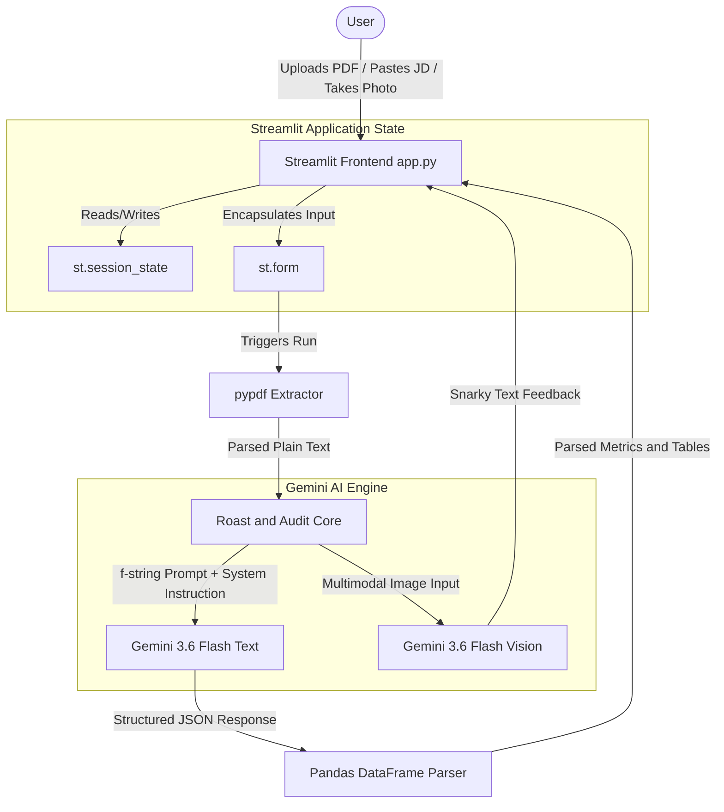

# AI Resume Critic and Tormentor System

This system is an advanced, interactive capstone project built with Streamlit and Gemini 3.6 Flash. It provides candidates with highly critical, multi-persona resume feedback and professional headshot evaluations to align their credentials with competitive job requirements.

## Live Application
[Live Deployment Link](https://airesumecritic-wjglch4zh4damfpm4x4t63.streamlit.app/)

## Project Walkthrough Video
[](https://youtu.be/4rvA049B88I)

## Problem Statement
Job seekers often struggle to identify exact alignment gaps between their resumes and target job descriptions. Traditional resume checkers provide static keyword checklists without context or qualitative critiques. This project solves this problem by:
1. Simulating real-world, high-pressure hiring personas to expose candidate weaknesses.
2. Highlighting critical keyword gaps and requirement discrepancies compared to target profiles.
3. Identifying weak action items and recommending high-impact, metrics-driven rewrites.
4. Performing professional headshot analyses to evaluate visual branding, lighting, and posture alignment.

## Features and Usage
1. **Multi-Persona Selection**: Select from different reviewer personas (Silicon Valley Recruiter, Disappointed Indian Parent, Savage Comedian, Struggling Musician, Tired Teacher, Brainrotted Teenager) to inspect your credentials through various critical lenses.
2. **Resume Roast and Gap Analysis**:
   - Upload your resume in PDF format or paste the plain text.
   - Paste the target job description.
   - Click the Roast button to receive an overall score, a metrics-based rating, a gap analysis of missing keywords, and detailed rewritten bullet points.
3. **Interactive Bullet Point Optimizer**: Edit your bullet points directly in the interface and review the suggestions side-by-side using the interactive data editor.
4. **Meme Card Panel**: View an animated meme illustrating the primary shortcomings of the credentials.
5. **Vibe Check (Vision)**: Upload or capture a webcam photo for a visual assessment of attire, lighting, and presentation style.

## System Architecture



---

## Data Flow and API Integration Strategy

1. **Structured Input Intake**:
   - User inputs are wrapped in forms to optimize resource usage and prevent premature API calls on every keystroke.
   - Text is parsed dynamically from PDF uploads using the pypdf reader.
2. **Dynamic Context Formulation**:
   - Inputs are injected into pre-configured prompt templates using Python f-strings.
   - The Text client uses a customized System Prompt defining the selected tormentor persona to steer output.
3. **Structured JSON Output**:
   - Using the google-genai SDK, we invoke client.models.generate_content with response_mime_type set to json and retrieve valid JSON configurations representing scores, verdicts, and lists of weak bullets.
4. **Reactive UI State Management**:
   - Application data (analysis output, photo data) is cached in session state to prevent data wipeout on page interactions.
5. **Tabular Rendering and Interactivity**:
   - The list of missing keywords is represented using interactive Pandas DataFrames.
   - The bullet points are loaded into the data editor, allowing users to mark items as resolved or mock-edit their bullet points right within the dashboard.

---

## Setup and Execution

### 1. Install Dependencies
Clone this repository and run:
```bash
pip install -r requirements.txt
```

### 2. Environment Configuration
Create a .env file in the root directory:
```env
API_KEY="your-gemini-api-key-here"
```

### 3. Run the Application
Start the Streamlit server:
```bash
streamlit run app.py
```

## Problem Statement and Category
This application resolves Problem 17 from Category D of the capstone curriculum:
* **Problem 17 - The AI Resume Critic (Tech-Roast)**: Users paste their resume text and a target job description. The AI acts as a ruthless Silicon Valley recruiter, highlighting missing keywords and weak bullet points.

---

## Acknowledgements
This project was built and was possible by the help of the mentors at Mirai School of Technology and has been built as a capstone for my AI summer internship there.

For more details on the project showcase, view my [LinkedIn Project Post](https://www.linkedin.com/feed/update/urn:li:activity:7495449315205885953/).
